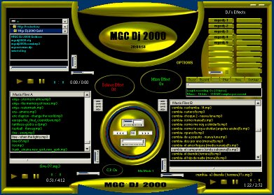



## MGC Dj 2000 Gold Edition

### Description

This is DJ Software designed with the better interface for a personal use or professional use, that it allow you to manage the music in a wide sense and without limitations, like a true DJ.

INFORMATION:

----

- Two Virtual Music´s Box Reproducer totally independent to each other, that they could reproduce any of the mentioned formats previously including their volume, balance, PITCH and other really impressive effects. Facilitating the mixture of songs, sounds, etc., maintaining maximum quality and fidelity in their reproduction.

- Section of Effects with direct access to the keyboard that permits a quick and important handling of samples and pre-elaborated effects, mixing with him reproduced live for the Music´s Box reproducer.

- Auto Save your Player configuration.

- Chronometer, indicator of song, volume, balance, PITCH, bar desplacer of time and searcher of music totally singular for each one of the Music´s Box Reproducer.

- And much, much more . . . , just try it and enjoy !!!

- PROFESSIONAL MP3 Dj Player - Encoder - Decoder - CD Ripper.

<< PLEASE VOTE ME !!! >> =)
 
### More Info
 

             |
---                |---
**Submitted On**   |2002-03-24 18:33:12
**By**             |[Martin G\. Caleau](https://github.com/Planet-Source-Code/PSCIndex/blob/master/ByAuthor/martin-g-caleau.md)
**Level**          |Advanced
**User Rating**    |4.4 (71 globes from 16 users)
**Compatibility**  |VB 6\.0
**Category**       |[Sound/MP3](https://github.com/Planet-Source-Code/PSCIndex/blob/master/ByCategory/sound-mp3__1-45.md)
**World**          |[Visual Basic](https://github.com/Planet-Source-Code/PSCIndex/blob/master/ByWorld/visual-basic.md)
**Archive File**   |[MGC\_Dj\_200652513252002\.zip](https://github.com/Planet-Source-Code/martin-g-caleau-mgc-dj-2000-gold-edition__1-33034/archive/master.zip)

